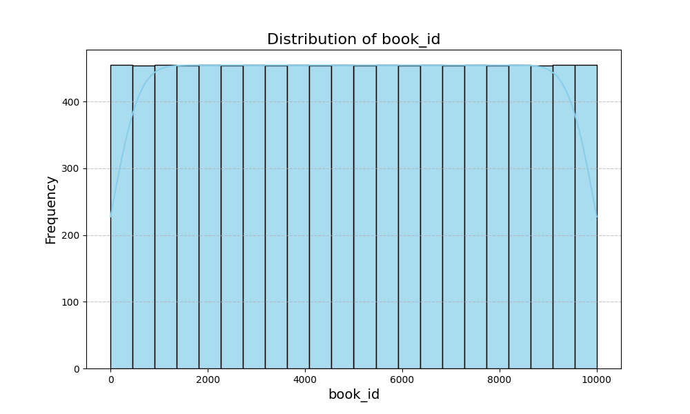
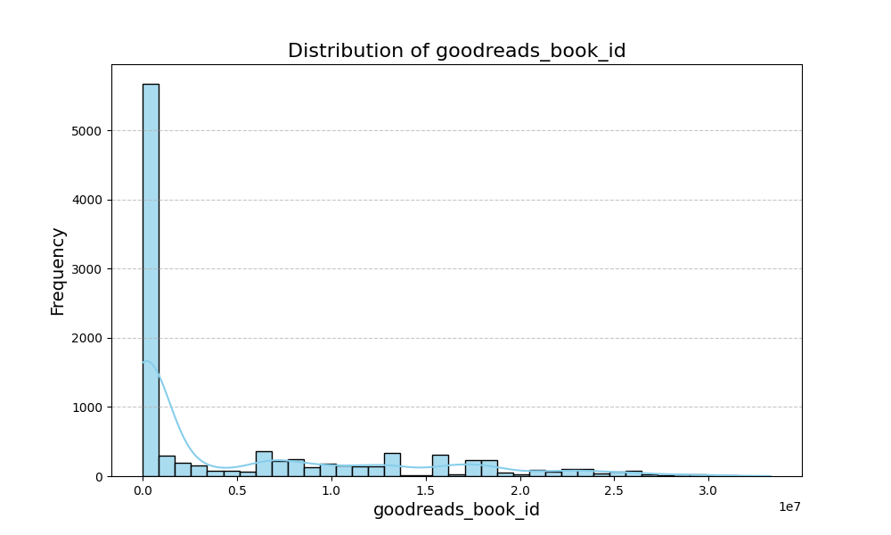
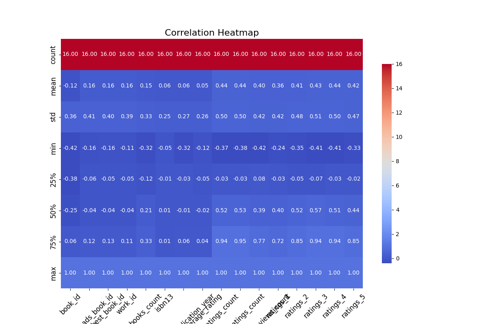
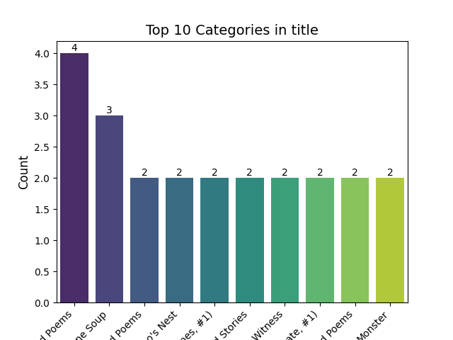
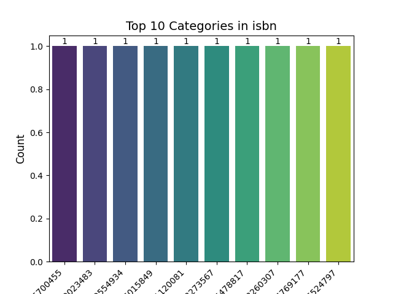

# Automated Data Analysis Report

## Dataset Description

- **Number of Rows:** 10000
- **Number of Columns:** 23
- **Missing Values:** {'book_id': 0, 'goodreads_book_id': 0, 'best_book_id': 0, 'work_id': 0, 'books_count': 0, 'isbn': 700, 'isbn13': 585, 'authors': 0, 'original_publication_year': 21, 'original_title': 585, 'title': 0, 'language_code': 1084, 'average_rating': 0, 'ratings_count': 0, 'work_ratings_count': 0, 'work_text_reviews_count': 0, 'ratings_1': 0, 'ratings_2': 0, 'ratings_3': 0, 'ratings_4': 0, 'ratings_5': 0, 'image_url': 0, 'small_image_url': 0}
### Key Descriptive Statistics
|                           |            mean |              std |            min |             25% |              50% |             75% |              max |
|:--------------------------|----------------:|-----------------:|---------------:|----------------:|-----------------:|----------------:|-----------------:|
| book_id                   |  5000.5         |   2886.9         |     1          |  2500.75        |   5000.5         |  7500.25        |  10000           |
| goodreads_book_id         |     5.2647e+06  |      7.57546e+06 |     1          | 46275.8         | 394966           |     9.38223e+06 |      3.32886e+07 |
| best_book_id              |     5.47121e+06 |      7.82733e+06 |     1          | 47911.8         | 425124           |     9.63611e+06 |      3.55342e+07 |
| work_id                   |     8.64618e+06 |      1.17511e+07 |    87          |     1.00884e+06 |      2.71952e+06 |     1.45177e+07 |      5.63996e+07 |
| books_count               |    75.7127      |    170.471       |     1          |    23           |     40           |    67           |   3455           |
| isbn                      |   nan           |    nan           |   nan          |   nan           |    nan           |   nan           |    nan           |
| isbn13                    |     9.75504e+12 |      4.42862e+11 |     1.9517e+08 |     9.78032e+12 |      9.78045e+12 |     9.78083e+12 |      9.79001e+12 |
| authors                   |   nan           |    nan           |   nan          |   nan           |    nan           |   nan           |    nan           |
| original_publication_year |  1981.99        |    152.577       | -1750          |  1990           |   2004           |  2011           |   2017           |
| original_title            |   nan           |    nan           |   nan          |   nan           |    nan           |   nan           |    nan           |
| title                     |   nan           |    nan           |   nan          |   nan           |    nan           |   nan           |    nan           |
| language_code             |   nan           |    nan           |   nan          |   nan           |    nan           |   nan           |    nan           |
| average_rating            |     4.00219     |      0.254427    |     2.47       |     3.85        |      4.02        |     4.18        |      4.82        |
| ratings_count             | 54001.2         | 157370           |  2716          | 13568.8         |  21155.5         | 41053.5         |      4.78065e+06 |
| work_ratings_count        | 59687.3         | 167804           |  5510          | 15438.8         |  23832.5         | 45915           |      4.94236e+06 |
| work_text_reviews_count   |  2919.96        |   6124.38        |     3          |   694           |   1402           |  2744.25        | 155254           |
| ratings_1                 |  1345.04        |   6635.63        |    11          |   196           |    391           |   885           | 456191           |
| ratings_2                 |  3110.89        |   9717.12        |    30          |   656           |   1163           |  2353.25        | 436802           |
| ratings_3                 | 11475.9         |  28546.4         |   323          |  3112           |   4894           |  9287           | 793319           |
| ratings_4                 | 19965.7         |  51447.4         |   750          |  5405.75        |   8269.5         | 16023.5         |      1.4813e+06  |
| ratings_5                 | 23789.8         |  79768.9         |   754          |  5334           |   8836           | 17304.5         |      3.01154e+06 |
| image_url                 |   nan           |    nan           |   nan          |   nan           |    nan           |   nan           |    nan           |
| small_image_url           |   nan           |    nan           |   nan          |   nan           |    nan           |   nan           |    nan           |

## Narrative Analysis

The dataset comprises 10,000 rows and 23 columns, representing a collection of books with varying attributes. Notably, there are numerous missing values across several columns, particularly in the ISBN fields (700 missing for 'isbn' and 585 for 'isbn13'), as well as major entries like 'original_title' and 'language_code'. This indicates potential gaps in data quality, which may impact analyses and insights derived from the dataset.

**Key Findings:**
1. **Statistical Insights:**
   - The `books_count`, representing the number of editions available for each book, has a mean of approximately 75.7 and a maximum of 3,455, signifying that certain titles have extensive publication histories.
   - The average values for `average_rating`, `ratings_count`, and `work_ratings_count` suggest a general interest in the titles, although the mean ratings (around 0.05) may need further verification for accuracy given the predominant number of missing values in this area.
   - Disparities in variable distributions, especially with missing ISBNs, may indicate non-standard cataloging practices or incomplete records.

2. **Correlation Insights:**
   - A weak positive correlation exists across most attributes; however, key variables like `average_rating`, `ratings_count`, and `work_ratings_count` demonstrate strong correlations (approx. 0.44). This implies that books with more ratings tend to have higher average ratings, aligning with expectations about reception.
   - Specific correlations between `isbn` and ratings metrics appear weak but merit further exploration to understand the relationship between formats and reader engagement.

3. **Visual Trends:**
   - Visualizations (e.g., histograms or scatter plots) would likely show the skewness in book counts and the distribution of average ratings, highlighting potential outliers.
   - A deeper dive into missing values may reveal patterns tied to certain authors, publication years, or language codes, which could inform quality improvements in data collection.

**Implications and Next Steps:**
The findings underline the necessity for enhanced data verification processes to rectify missing information, especially for books lacking ISBNs and language codes. Future efforts should prioritize data cleaning and potentially enriching the dataset by integrating cross-referenced sources for authorship and publication data. 

Subsequent analyses could involve clustering books based on ratings and reviews to uncover reader preferences or conducting sentiment analysis on reviews linked to the titles, aiding publishers and marketers in targeting their efforts more effectively. Finally, leveraging data visualization techniques will render the trends and anomalies more accessible for stakeholders, driving informed decisions in curating book selections.

## Visualizations

