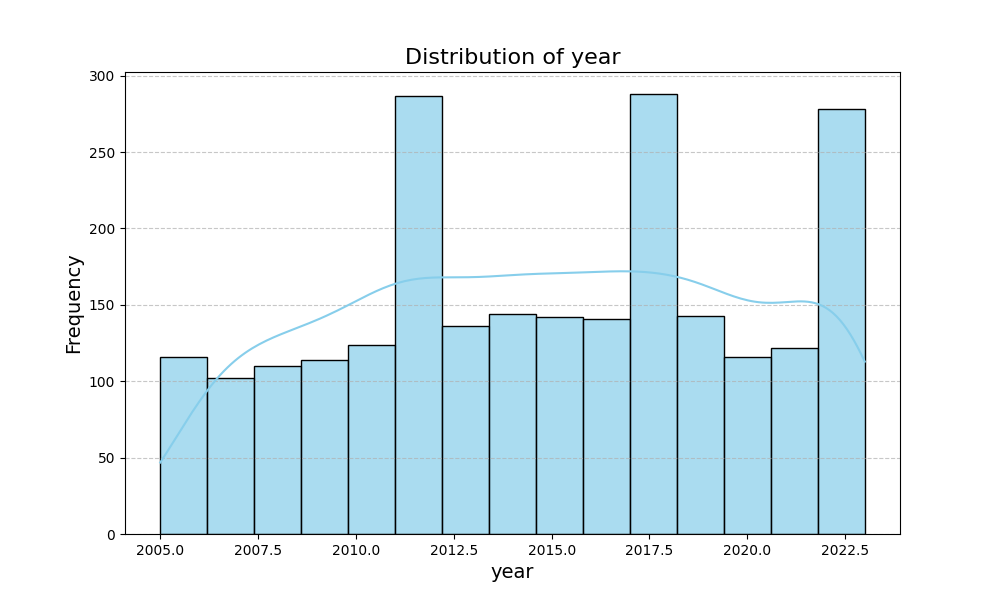
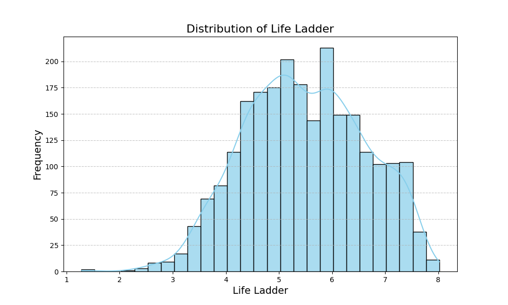
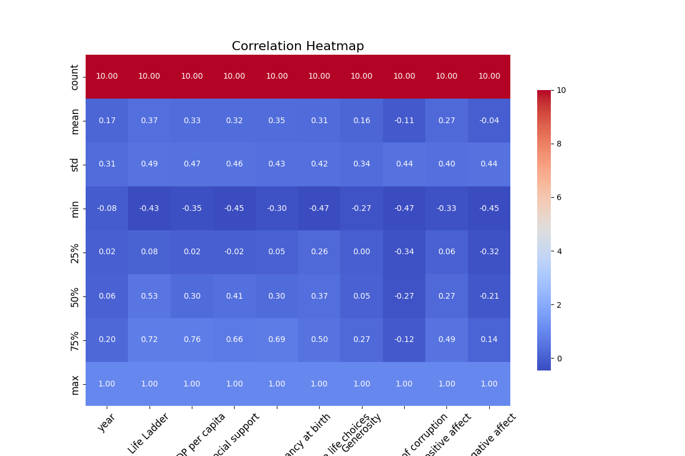
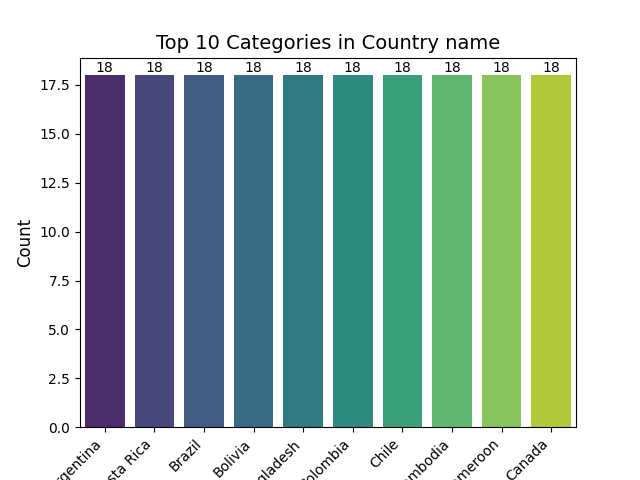

# Automated Data Analysis Report

## Dataset Description

- **Number of Rows:** 2363
- **Number of Columns:** 11
- **Missing Values:** {'Country name': 0, 'year': 0, 'Life Ladder': 0, 'Log GDP per capita': 28, 'Social support': 13, 'Healthy life expectancy at birth': 63, 'Freedom to make life choices': 36, 'Generosity': 81, 'Perceptions of corruption': 125, 'Positive affect': 24, 'Negative affect': 16}
### Key Descriptive Statistics
|                                  |           mean |         std |      min |       25% |       50% |        75% |      max |
|:---------------------------------|---------------:|------------:|---------:|----------:|----------:|-----------:|---------:|
| Country name                     |  nan           | nan         |  nan     |  nan      |  nan      |  nan       |  nan     |
| year                             | 2014.76        |   5.05944   | 2005     | 2011      | 2015      | 2019       | 2023     |
| Life Ladder                      |    5.48357     |   1.12552   |    1.281 |    4.647  |    5.449  |    6.3235  |    8.019 |
| Log GDP per capita               |    9.39967     |   1.15207   |    5.527 |    8.5065 |    9.503  |   10.3925  |   11.676 |
| Social support                   |    0.809369    |   0.121212  |    0.228 |    0.744  |    0.8345 |    0.904   |    0.987 |
| Healthy life expectancy at birth |   63.4018      |   6.84264   |    6.72  |   59.195  |   65.1    |   68.5525  |   74.6   |
| Freedom to make life choices     |    0.750282    |   0.139357  |    0.228 |    0.661  |    0.771  |    0.862   |    0.985 |
| Generosity                       |    9.77213e-05 |   0.161388  |   -0.34  |   -0.112  |   -0.022  |    0.09375 |    0.7   |
| Perceptions of corruption        |    0.743971    |   0.184865  |    0.035 |    0.687  |    0.7985 |    0.86775 |    0.983 |
| Positive affect                  |    0.651882    |   0.10624   |    0.179 |    0.572  |    0.663  |    0.737   |    0.884 |
| Negative affect                  |    0.273151    |   0.0871311 |    0.083 |    0.209  |    0.262  |    0.326   |    0.705 |

## Narrative Analysis

The dataset encompasses 2,363 rows across 11 columns, providing a comprehensive analysis of various factors influencing well-being across countries from 2005 to 2023. It includes key metrics such as the Life Ladder, GDP per capita, social support, freedom, generosity, perceptions of corruption, and emotional well-being indicators like positive and negative affect.

### Key Trends and Patterns
- **Temporal Coverage**: The data spans nearly two decades, with a mean year of approximately 2014.76, indicating a robust temporal scope for analysis.
- **Life Ladder Scores**: The mean Life Ladder score, indicative of perceived well-being, is 5.48, suggesting a generally moderate level of life satisfaction across the surveyed countries.

### Statistical Insights
- **Missing Values**: There are notable missing values in several columns, particularly in Generosity (81 missing), Perceptions of Corruption (125 missing), and Healthy Life Expectancy (63 missing). This may affect the overall analysis and interpretation of results.
- **Log GDP per Capita**: The mean Log GDP per capita is approximately 9.40, indicating a relatively high economic standing among countries in the dataset. However, variations in distribution (e.g., standard deviation of 1.15) highlight disparities in economic wealth.
- **Social Support**: The mean social support score of 0.81 suggests that, while many individuals feel supported, there are still gaps that need to be addressed in various nations.

### Correlation Insights
- **Moderate Correlations**: The strongest correlations appear between Life Ladder and both Log GDP per Capita (0.33) and Social Support (0.37). This aligns with the expectations that economic prosperity and social networks positively influence subjective well-being.
- **Negative correlation**: There is a noteworthy negative correlation between Generosity and Perceptions of Corruption (-0.11), suggesting that as perceptions of corruption increase, levels of generosity may decrease.

### Visualizations and Outliers
If visualized, the trends may indicate gradual improvements in metrics like Life Ladder over time, though significant outliers may exist in specific countries that could skew perceptions of standard experiences. A box plot or scatter plot of Life Ladder against Log GDP per Capita could visualize potential clusters or outliers effectively.

### Potential Implications and Next Steps
This dataset presents avenues for deeper investigation into how economic and social support systems affect well-being. Future analyses could include:
- **Time Series Analysis**: To evaluate how these metrics have evolved over the years.
- **Regional Comparisons**: Identifying trends across different geographical regions could spotlight areas needing targeted interventions.
- **Addressing Missing Data**: Employing imputation techniques or analyses that account for missing values would strengthen findings.

Overall, while the dataset exhibits a rich tapestry of well-being indicators, it also calls attention to significant gaps in data that should be addressed to enhance understanding and inform policy decisions.

## Visualizations

