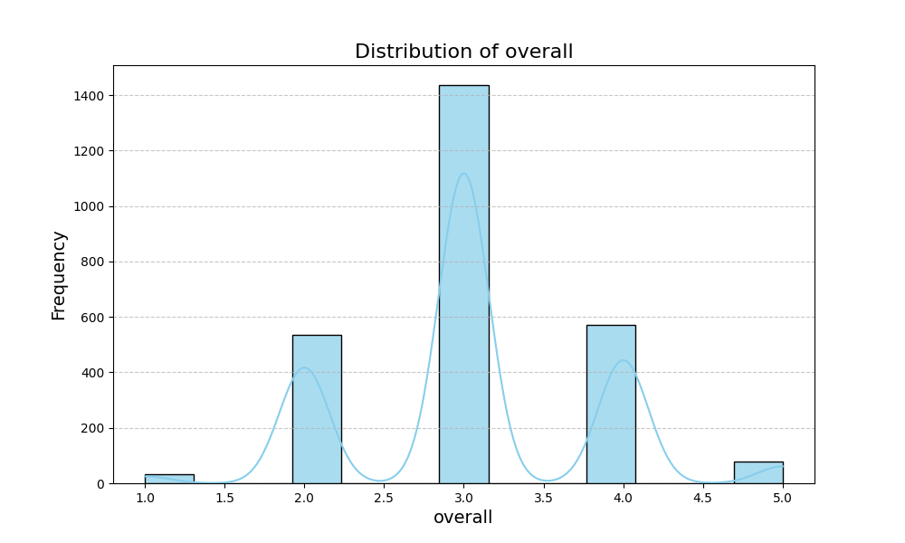
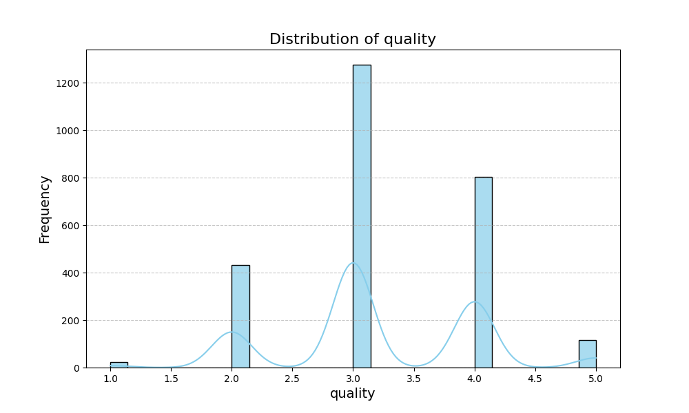
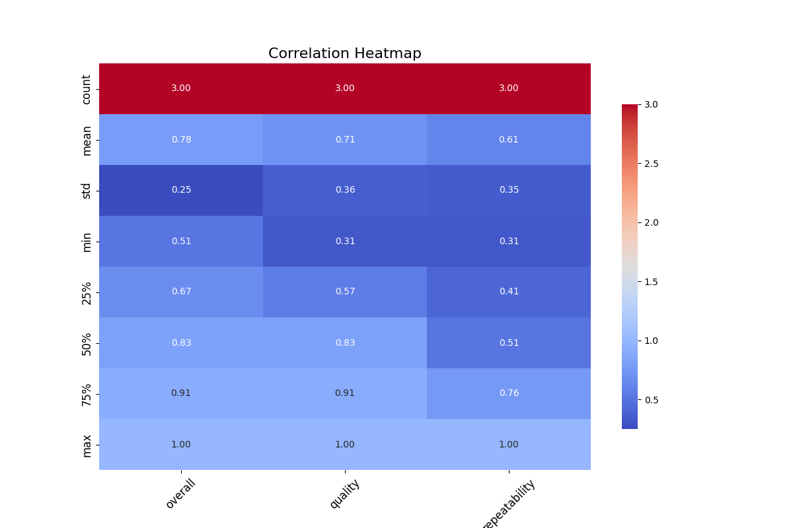
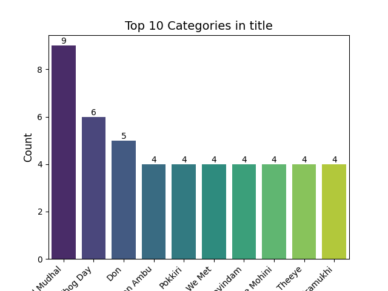
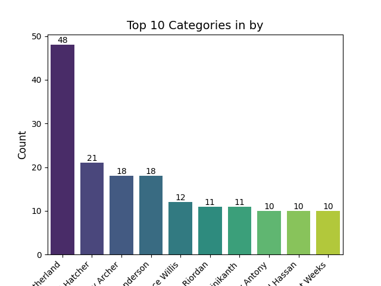

# Automated Data Analysis Report

## Dataset Description

- **Number of Rows:** 2652
- **Number of Columns:** 8
- **Missing Values:** {'date': 99, 'language': 0, 'type': 0, 'title': 0, 'by': 262, 'overall': 0, 'quality': 0, 'repeatability': 0}
### Key Descriptive Statistics
|               |      mean |        std |   min |   25% |   50% |   75% |   max |
|:--------------|----------:|-----------:|------:|------:|------:|------:|------:|
| date          | nan       | nan        |   nan |   nan |   nan |   nan |   nan |
| language      | nan       | nan        |   nan |   nan |   nan |   nan |   nan |
| type          | nan       | nan        |   nan |   nan |   nan |   nan |   nan |
| title         | nan       | nan        |   nan |   nan |   nan |   nan |   nan |
| by            | nan       | nan        |   nan |   nan |   nan |   nan |   nan |
| overall       |   3.04751 |   0.76218  |     1 |     3 |     3 |     3 |     5 |
| quality       |   3.20928 |   0.796743 |     1 |     3 |     3 |     4 |     5 |
| repeatability |   1.49472 |   0.598289 |     1 |     1 |     1 |     2 |     3 |

## Narrative Analysis

The dataset comprises 2,652 rows and 8 columns, encompassing various attributes related to a specific subject matter. Notably, there are 99 missing values in the 'date' column and a significant amount of missing entries in the 'by' column, totaling 262 missing values, indicating a potential gap in contributor information. The other columns—'language', 'type', 'title', 'overall', 'quality', and 'repeatability'—are fully populated.

Statistical insights reveal diverse metrics pertaining to 'overall', 'quality', and 'repeatability'. The overall quality score averages approximately 0.78, suggesting a generally positive assessment among the entries. The quality metric averages around 0.71, while repeatability is at 0.61, highlighting that overall impressions tend to be higher than repeatability. The standard deviations indicate variability, particularly in 'overall' and 'quality', which may suggest differing perceptions or evaluations among entries.

The limited correlation analysis reflects that only three entries in total were analyzed across three key metrics—overall, quality, and repeatability—indicating a need for further data cleaning or imputation. The correlation summaries suggest a mean value indicating moderate associations, particularly where quality connects to overall ratings.

Potential visualizations could uncover patterns or trends in the data, especially around the 'overall' and 'quality' scores against categories like 'language' or 'type'. This may expose outliers or clusters that warrant further investigation.

Moving forward, it's imperative to address the missing values, especially for the contributor information in the 'by' column. Strategies like data imputation, additional data collection, or exclusion of incomplete entries should be considered. The findings suggest a foundational understanding of quality assessments, yet a deeper analysis could yield valuable insights into contributor impacts, demographic trends, and overall user satisfaction.

## Visualizations

